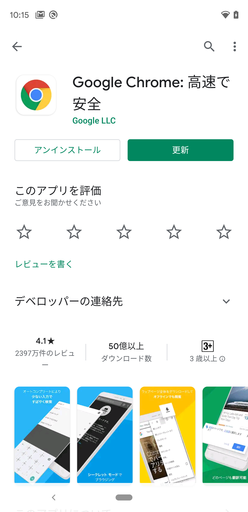
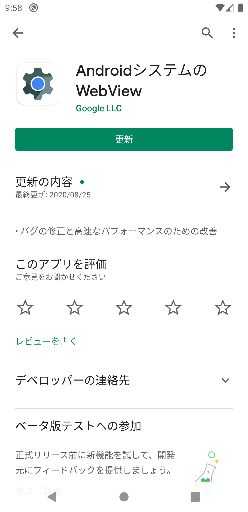

[TOP](/README.md#top)　> トラブルシューティング

---

# トラブルシューティング

* [01. エミュレータで広告が表示されない](#cant_display_on_emulator)

## 01. エミュレータで広告が表示されない

**もし `AdStateListener$onLoadSuccess`がコールバックされても広告が表示されない場合、以下を試してください。** **GoogleChromeまたはWebViewが古い場合、広告が表示されない場合がございます。**

エミュレータにインストールされている[`Google Chrome`](https://play.google.com/store/apps/details?id=com.android.chrome)のバージョンを確認し、もし古ければ最新にアップデートしてください。

アップデート前 | アップデート後
:--: | :--:
|

 

エミュレータにインストールされている[`Android System WebView`](https://play.google.com/store/apps/details?id=com.google.android.webview)のバージョンを確認し、もし古ければ最新版にアップデートしてください。

Before update | After update
:--: | :--:
|

---
[TOP](/README.md#top)

---
LANGUAGE :
> 
