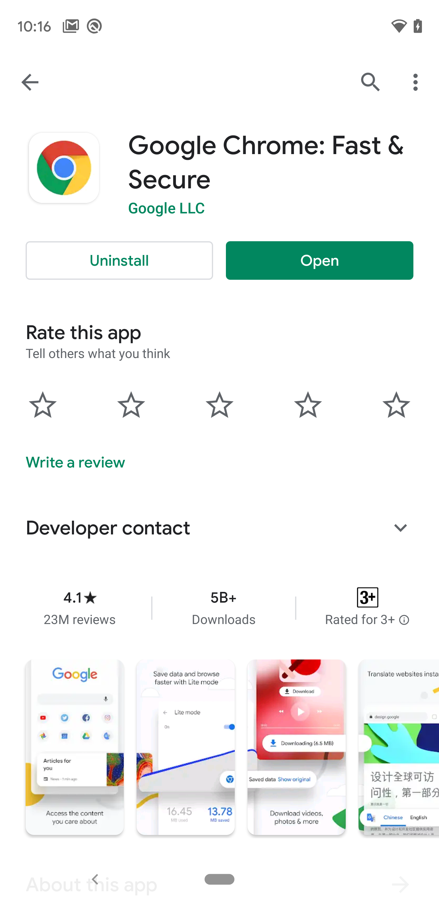
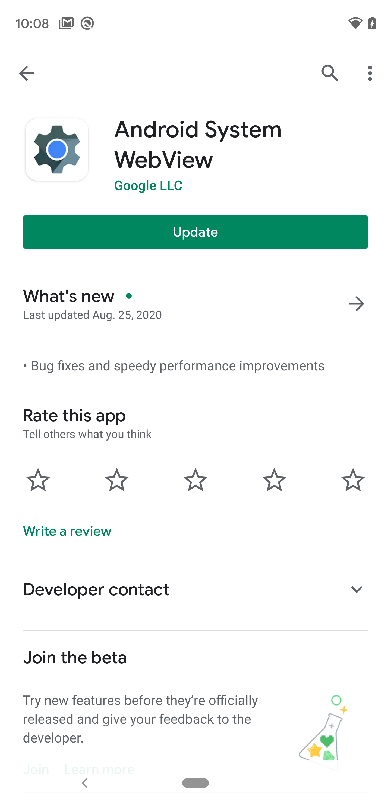
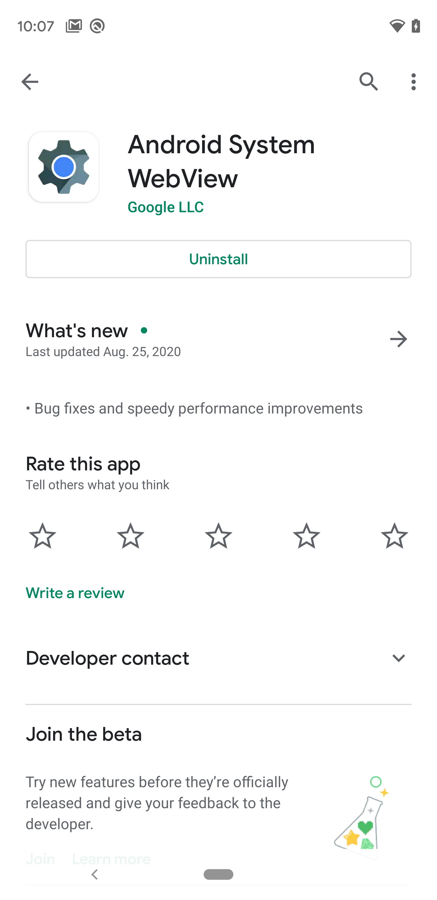

[TOP](/README.md#top)　>　 Troubleshooting

---

# Troubleshooting

- [01. Ads won't appear](#cant_display_ad)

## 01. Ads won't appear

**If `AdStateListener` calls back `onLoadSuccess()` but Ads does not appear, &nbsp; please try below.**

Make sure the version of [`Google Chrome`](https://play.google.com/store/apps/details?id=com.android.chrome). And update to the latest version if it was old.

|                 Before update                  |                  After update                  |
| :--------------------------------------------: | :--------------------------------------------: |
|  |  |

 

Make sure the version of [`Android System WebView`](https://play.google.com/store/apps/details?id=com.google.android.webview). And update to the latest version if it was old.

|                  Before update                  |                  After update                   |
| :---------------------------------------------: | :---------------------------------------------: |
|  |  |

In addtion, the following conditions or operations may cause the version of Chrome or WebView to be reset to its initial state

- Factory-sealed
- Reset
- Clean up OS

---

[TOP](/README.md#top)

---

LANGUAGE :

> 
